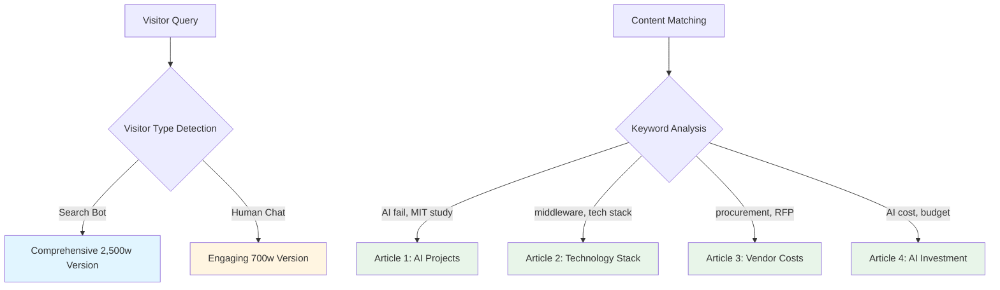
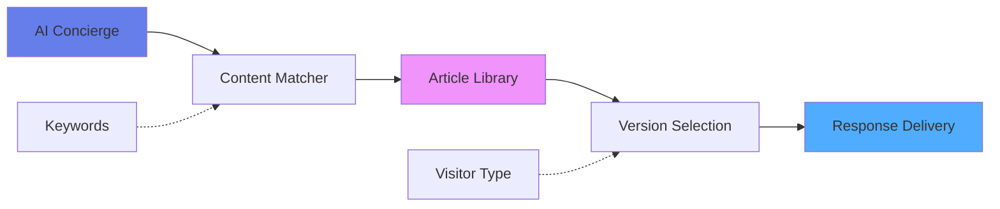

# Thought Leadership Article Integration - Executive Summary

## What We Built

Integrated 4 thought leadership articles into the AI concierge system with intelligent content serving based on visitor type.

## Article Library

| Article | Topic | Human Version | Bot/SEO Version |
|---------|-------|---------------|-----------------|
| **Article 1** | Why Most AI Projects Fail | 700 words | 2,500 words |
| **Article 2** | Worthless Technology Stack | 700 words | 2,500 words |
| **Article 3** | Hidden Vendor Costs | 700 words | 2,500 words |
| **Article 4** | Complete Cost of AI | 700 words | 2,500 words |

## How It Works

## Key Features

### 1. Smart Content Serving
- **Bots/Search Engines**: Get comprehensive 2,500-word articles with full SEO optimization
- **Human Visitors**: Get engaging 700-word versions optimised for LinkedIn, newsletters, and chat

### 2. Intelligent Routing
- Keyword matching routes queries to relevant articles
- Context-aware responses based on visitor patterns
- Related content suggestions for deeper engagement

### 3. SEO Optimisation
- Schema.org structured data for search engines
- Comprehensive keyword coverage across all topics
- Cross-linking between related articles

## Business Impact

### Content Reach
- **4 core topics** covering AI implementation, technology optimization, procurement, and investment planning
- **Dual-format strategy** maximises both SEO visibility and human engagement
- **10,000+ words** of searchable, bot-optimised content for organic discovery

### Competitive Positioning
- Establishes thought leadership across key client pain points
- Demonstrates expertise through case studies (insurance brokerage transformation)
- Positions Context is Everything as context-aware implementation specialists

### Lead Generation
- Articles naturally lead to consultation CTAs
- Query-based serving ensures relevant content for visitor intent
- Multi-touch engagement through related content suggestions

## Technical Architecture

## Status

✅ **All 4 articles deployed to production**
✅ **Content matching system operational**
✅ **Multi-version serving active**
✅ **SEO optimization complete**

## Next Steps (Optional)

1. Monitor query patterns to refine keyword matching
2. Add performance analytics for article engagement
3. Expand library with additional topics based on visitor queries
4. A/B test different CTA placements for conversion optimization

---

**Deployment Date**: January 2025
**Production URL**: https://context-is-everything-o84o6ihqt-sthursfields-projects.vercel.app
**Total Content**: 12,800+ words across 8 versions (4 human + 4 bot)
