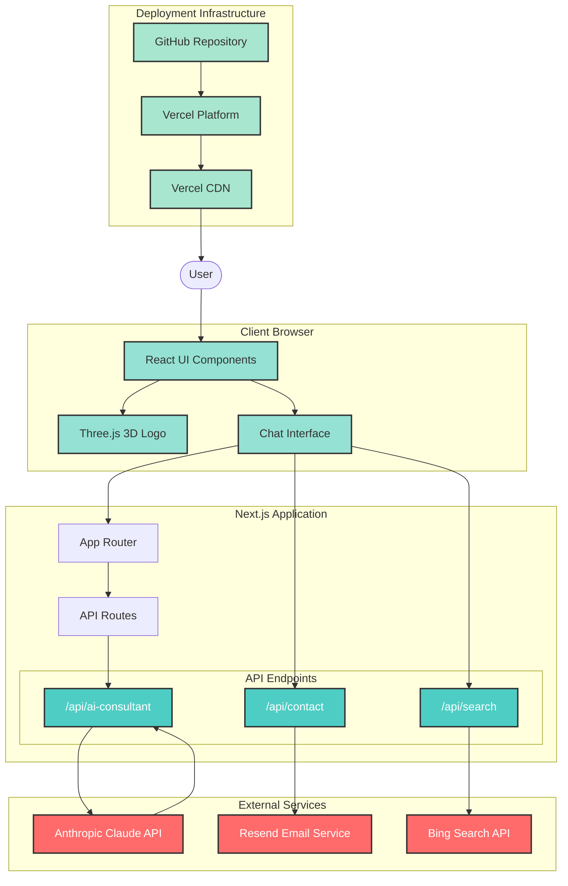

# Architecture Overview - Context is Everything

**Status**: Complete
**Generated**: 2025-09-25

## System Architecture Diagram



## Simple Explanation

### What It Is
**Context is Everything** is a modern AI consultancy website built with Next.js that showcases how context shapes perspective through interactive 3D visuals and intelligent conversation.

### Core Components

#### 1. **Frontend (What Users See)**

- **3D Animated Logo**: Interactive wireframe mountain built with Three.js that responds to mouse movement
- **Chat Interface**: Google-style conversational UI with smart suggestion buttons (Foundation, Findings, Focus, Future, First)
- **Contextual Theming**: Automatic color themes that change based on time of day (Dawn, Midday, Storm, Night)

#### 2. **Backend (How It Works)**

- **Next.js App Router**: Handles page rendering and routing with React Server Components
- **API Routes**: Three main endpoints:
  - `/api/ai-consultant`: Processes chat messages using Anthropic's Claude AI
  - `/api/contact`: Sends email messages via Resend service
  - `/api/search`: Performs web searches through Bing API

#### 3. **External Services (Third Parties)**

- **Anthropic Claude**: Powers the AI consultant responses with sophisticated business insights
- **Resend**: Handles email delivery when users submit contact forms
- **Bing Search API**: Provides real-time web search capabilities for current information

#### 4. **Deployment (How It's Delivered)**

- **GitHub**: Stores the code repository and tracks changes
- **Vercel**: Automatically builds and deploys the site when code is pushed
- **CDN**: Distributes the site globally for fast loading anywhere

### How It All Fits Together

1. **User visits the site** → Vercel CDN serves the Next.js application
2. **3D mountain loads** → Three.js renders animated contour lines in the browser
3. **User clicks a chat button** → Request goes to the appropriate API route
4. **AI processes the request** → Claude API generates contextual business insights
5. **Response appears in chat** → Formatted with professional styling and markdown
6. **User submits contact form** → Resend API sends email to the team
7. **Theme changes with time** → Browser checks local time and updates colors automatically

### Key Technologies

| Component | Technology | Purpose |
|-----------|-----------|---------|
| Framework | Next.js 15 | React-based full-stack application |
| 3D Graphics | Three.js + React Three Fiber | Interactive 3D mountain animation |
| Styling | Tailwind CSS | Responsive, utility-first styling |
| AI | Anthropic Claude | Intelligent conversation and insights |
| Email | Resend | Reliable email delivery |
| Search | Bing API | Real-time web information |
| Hosting | Vercel | Deployment and global CDN |
| Version Control | Git/GitHub | Code management and collaboration |

### Security & Performance

- **API Keys**: All sensitive keys stored as environment variables, never in code
- **Rate Limiting**: API endpoints protected against abuse
- **Responsive Design**: Optimized for mobile and desktop viewing
- **Lazy Loading**: 3D components load only when needed
- **Edge Functions**: API routes run close to users for fast responses

### File Structure

```text
context-is-everything/
├── src/
│   ├── app/                 # Next.js app router
│   │   ├── api/             # Backend API endpoints
│   │   └── page.tsx         # Main homepage
│   ├── components/          # React components
│   │   ├── WireframeMountain.tsx  # 3D mountain
│   │   └── ChatInterface.tsx      # Chat UI
│   └── hooks/              # Custom React hooks
│       └── useContextualTheme.tsx # Time-based theming
├── public/                 # Static assets
└── docs/                   # Documentation
```

This architecture provides a sophisticated yet performant AI consultancy platform that demonstrates how context shapes perspective through both visual metaphor (3D rotation) and intelligent conversation (AI responses).
